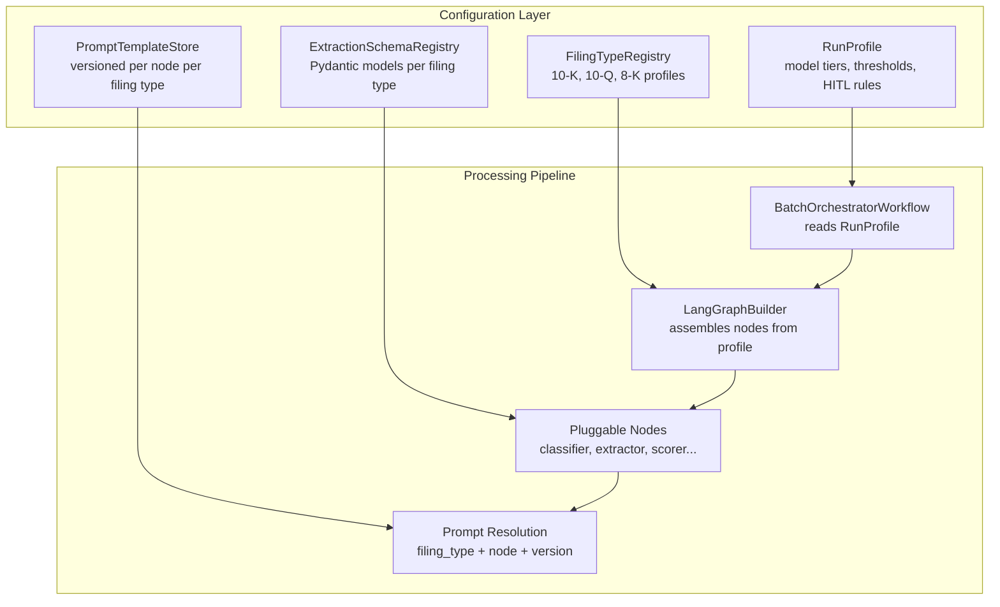

# SEC AlphaOps: Configurable SEC Filing Intelligence Pipeline

## Project concept

Build a **production-style AI operations platform** that ingests SEC filings in batch, extracts structured risk/finance insights, routes uncertain outputs to human review, and streams live processing status to a Next.js dashboard. The system is **configuration-driven**: 10-K annual reports are the MVP filing type, but the architecture supports 10-Q, 8-K, and other filing types via pluggable registries -- adding a new filing type requires a config profile, prompt templates, and an output schema, with zero workflow code changes.

This demonstrates deep understanding of:

- **Temporal** for durable orchestration, retries, backoff, scheduling, and long-running batch jobs
- **LangGraph** for stateful multi-step extraction logic with node-level caching
- **LangChain** for retrieval, tool integration, and model abstraction
- **Postgres + Redis Cloud** for durable state and low-latency cache/event fanout
- **SSE + Next.js** for real-time observability UX
- **Configuration-driven extensibility** for multi-filing-type support without code changes

## Why this is impressive

- Goes beyond chatbot: true **workflow orchestration + HITL governance + ops dashboard**
- Shows **failure-tolerant batch design** (timeouts, retries, idempotency, dead-letter handling)
- Demonstrates **auditability**: every extraction decision is traceable and reviewable
- Aligns with real enterprise need: compliance-ready financial document intelligence
- **Extensible by configuration**: new SEC filing types (10-Q, 8-K) plug in via registry profiles, not code forks

## System architecture

```mermaid
flowchart LR
  subgraph configLayer [Configuration]
    runProfile["RunProfile"]
    filingRegistry["FilingTypeRegistry"]
  end

  hydrate[CacheHydrateWorkflow\nget_filings + R2 sync] --> filingCache[(FilingCache\n~/.edgar or R2)]
  runProfile --> orchestrator[BatchOrchestratorWorkflow]
  filingRegistry --> orchestrator
  orchestrator --> fetchActivity[FetchFilingActivity\nlocal-first read]
  filingCache -.->|"cache hit\nno network"| fetchActivity
  fetchActivity --> parseActivity[ParseChunkActivity]
  parseActivity --> langGraphActivity["LangGraphAnalysisActivity\nLangGraphBuilder + CachePolicy"]
  langGraphActivity --> workflowGate{"Temporal\nConfidenceGate"}
  workflowGate -->|"highConfidence"| persistActivity[PersistInsightsActivity]
  workflowGate -->|"lowConfidence"| reviewWorkflow[HumanReviewWorkflow]
  reviewWorkflow --> reviewUi[NextJSReviewUI]
  reviewUi --> temporalUpdate[TemporalUpdate]
  temporalUpdate --> reviewWorkflow
  reviewWorkflow --> persistActivity
  persistActivity --> postgres[(Postgres)]
  persistActivity --> redisStreams[(RedisStreams\n+ RedisSaver)]
  redisStreams --> sseEndpoint[FastAPI SSE\nsse-starlette]
  postgres --> sseEndpoint
  sseEndpoint -->|"EventSource\nLast-Event-ID"| dashboard[RealtimeOpsDashboard]
```

## Project setup decisions

- **Repository strategy**
  - Use a single **monorepo** for frontend + backend + workers to share contracts and speed up iteration.
- **Frontend stack**
  - Next.js App Router + TypeScript + Tailwind CSS.
  - UI components with `shadcn/ui`.
  - Charts with `recharts`, data tables with `@tanstack/react-table`, icons with `lucide-react`.
  - Realtime transport: **long-lived SSE** from `apps/api` (FastAPI on Render) directly to browser.
  - **SSE architecture**: the browser connects directly to the Render-hosted API SSE endpoint (`NEXT_PUBLIC_SSE_URL`), bypassing Vercel entirely for the streaming connection. Vercel serverless functions have execution timeouts (10s Hobby / 60s Pro) that would kill long-lived SSE. Render web services have no such limit, making them the correct termination point for connections that may last minutes to hours during a batch run.
  - **CORS requirement**: since `apps/web` (Vercel) and `apps/api` (Render) are on different origins, the FastAPI API must return CORS headers on all endpoints including the SSE route. Use FastAPI's `CORSMiddleware` with `allow_origins` set to the Vercel deployment URL (from an env var like `ALLOWED_ORIGINS`). `EventSource` does not send preflight OPTIONS requests for simple GET, but the `Access-Control-Allow-Origin` response header is still required or the browser will block the stream.
  - **SSE client library**: `reconnecting-eventsource` (zero-dependency drop-in wrapper around native `EventSource`; adds retry on 502/503 where native `EventSource` silently gives up). Upgrade path to `event-source-plus` if custom auth headers or advanced retry backoff are needed later.
- **Backend stack**
  - Python services for ingestion/API workers and Temporal worker runtime.
  - Use `uv` as package manager for speed and reliable lockfile-based installs.
  - Manage dependencies with `pyproject.toml` + `uv.lock`.
  - **SSE server library**: `sse-starlette` (`EventSourceResponse`) for W3C-compliant SSE from FastAPI. Provides structured `ServerSentEvent` objects with `id`/`event`/`data`/`retry` fields, automatic client disconnect detection, 15s keepalive pings to prevent proxy kills, and graceful shutdown. Each event's `id` is set to the Redis Stream entry ID so reconnecting clients resume via `Last-Event-ID` with zero custom logic.
- **Cross-language contract strategy** (eliminates manual type synchronization)
  - **API types**: FastAPI auto-generates an OpenAPI spec from Pydantic models at `/openapi.json`. Run `openapi-typescript` against that spec to auto-generate TypeScript types into `packages/contracts/api.d.ts`. These are **compile-time type declarations only** (erased at runtime). For most dashboard use cases, compile-time safety is sufficient. If runtime response validation is needed later, use the companion `openapi-fetch` package as a type-safe fetch client. No manual Zod schemas -- the Python Pydantic models are the single source of truth and the TypeScript types are derived artifacts.
  - **SSE event payloads**: Pydantic models for SSE events are the single source of truth. At build time, export their JSON Schema via `model.model_json_schema()` into `packages/contracts/sse-events.schema.json`. On the TypeScript side, run `json-schema-to-zod` (706K weekly downloads) to generate Zod runtime validators from that schema file. The flow is: **Pydantic models --> JSON Schema file --> Zod validators**. Python never "loads" a schema -- it produces it. This guarantees the SSE producer (Python) and consumer (TypeScript) always agree on shape.
  - **CI enforcement**: add a `generate-contracts` CI step that (1) boots the FastAPI app, (2) fetches `/openapi.json`, (3) runs `openapi-typescript` to regenerate `api.d.ts`, and (4) fails if the generated output differs from what is committed (drift detection). This catches contract mismatches before merge.
  - This reduces the "two languages" maintenance tax to two CI runtimes and two linting configs -- a fixed cost that does not grow with project complexity.
- **Data/storage strategy**
  - Postgres is system of record (audit, workflow state projections, review decisions).
  - Redis Cloud for cache and low-latency fanout for dashboard counters/events.
  - Cloudflare R2 for large raw/intermediate artifacts (S3-compatible, cost-effective for side projects).
- **SEC filing ingestion strategy** (cache-first)
  - Use `edgartools` `get_filings(form=["10-K"], year=...)` to query filings by type and year, then iterate results to download each filing. Note: `download_filings()` downloads the full EDGAR daily index without type filtering; `get_filings(form=...)` is the correct API for type-specific queries.
  - **Local development**: workers read filings from `~/.edgar` local cache via `use_local_storage()` -- zero network requests, 79x faster on repeat runs.
  - **Production (Render)**: Render workers have an **ephemeral filesystem** -- local `~/.edgar` is wiped on every deploy/restart. In production, `CacheHydrateWorkflow` downloads filings and uploads them to R2 (`cache/{filing_type}/{ticker}/{year}/`). Workers read filings from R2 at runtime via boto3, not from local disk. R2 reads are fast (~10-50ms) and don't count against EDGAR rate limits.
  - Rate limit (10 req/s) only applies during the one-time hydration step, which runs as a separate `CacheHydrateWorkflow` before the batch processing workflow begins.
- **LLM & embedding model strategy**
  - **Production** (single key: `OPENAI_API_KEY`):
    - **Extraction/analysis (default)**: `gpt-4.1-mini` -- $0.40/M input, $1.60/M output, 1M token context window. Fits entire 10-K filings in a single call. Best quality/cost balance for structured extraction, section summarization, and KPI parsing.
    - **Complex reasoning (escalation)**: `gpt-4.1` -- $2.00/M input, $8.00/M output, 1M token context. Reserve for multi-step cross-section reasoning in `crossCheckNode` or when `gpt-4.1-mini` extraction quality is insufficient for a specific node.
    - **Classification/routing**: `gpt-4.1-nano` -- $0.10/M input, $0.40/M output, 128K token context. For fast, cheap tasks: section classification, confidence pre-scoring, intent routing, or simple yes/no policy checks.
    - **Embeddings**: `text-embedding-3-small` -- 1536 dimensions, ~$0.02/M tokens, 8192 max input tokens. Sufficient for financial document retrieval and RAG. Upgrade path to `text-embedding-3-large` (3072 dims, 64.6% MTEB) if retrieval recall needs improvement.
  - **Local development** (no API key required):
    - **Chat/extraction**: Ollama with `qwen2.5:7b` or `llama3.1:8b` -- free, zero network dependency.
    - **Embeddings**: Ollama with `nomic-embed-text` -- fast local embeddings for development and testing.
    - Toggle via `LLM_PROVIDER=openai|ollama` env var. LangChain's model abstraction (`BaseChatModel`, `Embeddings` interfaces) makes swapping transparent -- no code changes between environments.
  - **Cost estimate** (example batch: 50 companies x 5 years = 250 filings):
    - Embedding all chunks with `text-embedding-3-small`: ~$0.50
    - Extraction with `gpt-4.1-mini`: ~$5-15 depending on chunk count and output length
    - Escalation calls to `gpt-4.1` for `crossCheckNode`: ~$2-5
    - Total per batch run: under $20
  - **OpenAI rate limit handling**: OpenAI enforces per-minute request and token rate limits that vary by usage tier. With 250 filings x 6 nodes = 1,500+ LLM calls per batch, rate limiting is a production concern.
    - **Worker-side concurrency control**: use a shared semaphore or token-bucket limiter in the Temporal activity to cap concurrent OpenAI requests per worker instance (e.g., 20 concurrent calls). This prevents bursting past the RPM limit when many activities run in parallel.
    - **Retry with backoff**: wrap LLM calls with exponential backoff on `429 Too Many Requests` responses. LangChain's `ChatOpenAI` supports `max_retries` and respects OpenAI's `Retry-After` header natively.
    - **Temporal retry policy**: set `LangGraphAnalysisActivity` retry policy with `non_retryable_error_types` excluding `RateLimitError` so Temporal retries on transient 429s but fails fast on 400-level errors (bad prompt, invalid model).
    - **Monitoring**: log token usage per node per filing; aggregate per batch run in the `workflow_runs` table to track cost and detect prompt regressions that inflate token counts.
  - **Model assignment by LangGraph node**:
    - `sectionClassifier`: `gpt-4.1-nano` (fast classification, lowest cost)
    - `riskExtractor`, `kpiExtractor`: `gpt-4.1-mini` (structured extraction workhorse)
    - `crossCheckNode`: `gpt-4.1` (multi-section reasoning requires highest quality)
    - `confidenceScorer`: `gpt-4.1-nano` (numerical scoring, low complexity)
    - `policyGuard`: `gpt-4.1-nano` (binary pass/fail checks)

## Configuration & extensibility architecture

The system treats **filing type as a configuration axis, not a code branch**. Every component that touches filing-specific logic resolves it through a registry lookup, never an `if filing_type == "10-K"` check. This means adding 10-Q or 8-K support requires a new config profile + prompt templates + output schema -- zero workflow code changes.

- **FilingTypeRegistry** -- each filing type is a declarative config profile (Python dataclass in `packages/common/config/`) defining:
  - **Sections to extract**: 10-K targets Item 1A (Risk Factors), Item 7 (MD&A), Item 8 (Financial Statements); 10-Q targets Part II Item 1A; 8-K targets numbered Item events
  - **LangGraph node set and edge topology**: which nodes to include and how they connect. 10-K uses all 6 nodes; 8-K might use only `eventClassifierNode` + `confidenceScorer` + `policyGuard`
  - **Model tier overrides per node**: allows filing-type-specific model assignment (e.g., 8-K always uses `gpt-4.1-nano` since documents are short)
  - **Confidence thresholds for HITL routing**: 8-K may have lower thresholds since they are time-sensitive; 10-K may have higher thresholds for thoroughness
  - **Output schema reference**: pointer to the filing-type-specific Pydantic model in `ExtractionSchemaRegistry`
- **PromptTemplateStore** -- externalized, versioned prompt templates keyed by `(filing_type, node_name, version)`:
  - Stored as template files (Jinja2 or plain text with variable substitution) in `packages/langgraph/prompts/{filing_type}/{node_name}/v{N}.txt`
  - Loaded at runtime by node name + filing type + version from the `RunProfile`
  - **Versioning strategy**: prompt files are version-controlled in Git and deploy with the container image. Changing a prompt means adding a new version file (e.g., `v3.txt`) and deploying. This is not hot-swappable at runtime -- the tradeoff is deployment safety over speed. The `prompt_versions` Postgres table records which version was active for each run (audit log), not which versions are available (that's the filesystem).
  - `ReprocessingWorkflow` leverages this: "re-run filings from run X with prompt version 3 instead of version 2" -- both versions exist in the deployed image, the `RunProfile` selects which one to use
  - **Future upgrade path**: if runtime prompt editing is needed (e.g., for a multi-tenant SaaS), move prompt storage to R2 or Postgres and add a prompt management UI. The `PromptTemplateStore` interface stays the same; only the backing storage changes.
- **ExtractionSchemaRegistry** -- pluggable Pydantic output models per filing type:
  - Base `ExtractionResult` interface defines shared fields: `confidence`, `rationale`, `citations`, `provenance_ids`, `filing_type`
  - Filing-type-specific subclasses add their own fields: `TenKExtractionResult` has `risk_factors`, `kpi_data`, `segment_breakdown`; `EightKExtractionResult` has `event_type`, `material_impact`, `effective_date`
  - Dashboard renders extraction results based on schema metadata (`model_json_schema()`), not hardcoded field names -- new filing types automatically get correct display
  - JSON Schema export feeds the cross-language contract pipeline (Pydantic -> JSON Schema -> Zod)
- **RunProfile** (formalizes the existing concept) -- first-class input object for `BatchOrchestratorWorkflow`:
  - `filing_types: list[str]` -- which filing types to process in this run (e.g., `["10-K"]` or `["10-K", "10-Q"]`)
  - `tickers: list[str]` -- company ticker list
  - `years: list[int]` -- filing year range
  - `model_overrides: dict[str, str]` -- per-node model tier overrides (e.g., `{"crossCheckNode": "gpt-4.1"}`)
  - `confidence_thresholds: dict[str, float]` -- per-node or global confidence thresholds
  - `hitl_mode: Literal["auto_approve_all", "review_all", "threshold_based"]` -- HITL routing strategy
  - `prompt_version: str | None` -- pin a specific prompt version (defaults to latest)

## Deployment baseline (confirmed)

- **Frontend (`apps/web`)**
  - Deploy on Vercel (or Render static/web service if single-provider preference later).
- **Backend API (`apps/api`)**
  - Deploy as Render **web service** with **auto-scaling** enabled (Render paid plans support scaling to multiple instances behind a managed load balancer). Each instance runs the same FastAPI process, handles REST API requests, and terminates SSE connections independently.
  - **SSE scaling**: since every API instance reads from Redis Streams with `XREAD` using per-connection cursors, SSE connections are stateless from the server's perspective -- any instance can serve any client's stream. Render's load balancer distributes new `EventSource` connections across instances. On reconnect, `Last-Event-ID` ensures zero missed events regardless of which instance serves the new connection.
  - Start with 1 instance for MVP; scale to 2-3 instances when concurrent SSE connections or REST API latency warrant it.
- **Backend worker (`apps/worker`)**
  - Deploy as **N Render background worker instances**, all polling the same `TEMPORAL_TASK_QUEUE`. Temporal distributes activity tasks via sticky execution and round-robin; adding instances linearly increases throughput with zero code changes.
  - **Scaling strategy**: start with 1 instance for MVP. Scale to 2-4 instances for 1,000+ filing batches. Each instance is identical (same image, same env vars, same task queue). Deploy each as a separate Render background worker service (e.g., `worker-1`, `worker-2`) sharing the same deploy hook trigger.
  - **Task queue isolation** (optional, for workload shaping): use separate task queues for CPU-heavy activities (`LangGraphAnalysisActivity`) vs. I/O-heavy activities (`FetchFilingActivity`, `SyncCacheToR2Activity`). This allows scaling LLM workers independently of download workers.
  - Note: Render does **not** support health checks on background workers (health checks are web-service only). Monitor worker liveness via Temporal task queue metrics (backlog depth, poll success rate) and external uptime monitoring (e.g., Better Stack, Heii On-Call) if needed.
- **Temporal cluster**
  - Deploy on Render using the Temporal blueprint/model from Render docs.
  - Keep Temporal services private in Render private network and colocate API/worker services for internal connectivity.
  - Follow Render Temporal deployment guidance and health checks from:
    - [https://render.com/docs/deploy-temporal](https://render.com/docs/deploy-temporal)
- **Datastores**
  - Postgres on Render managed Postgres (paid plan; 100+ connection limit, read replica support).
  - Redis on Redis Cloud (paid plan; ample memory for checkpoints, streams, and caches).
  - Object storage on Cloudflare R2.
- **Network assumptions**
  - API and worker communicate with Temporal over Render private network.
  - External Temporal access is not required for MVP; use Temporal UI access pattern from Render docs when needed.

## Deployment environment matrix

- **`apps/web` (Vercel)**
  - `NEXT_PUBLIC_API_BASE_URL` - public URL of `apps/api`.
  - `NEXT_PUBLIC_SSE_URL` - SSE endpoint URL (usually under `apps/api`).
  - `NEXTAUTH_URL` - frontend base URL.
  - `NEXTAUTH_SECRET` - auth/session secret.
- **`apps/api` (Render web service)**
  - `APP_ENV=production`
  - `PORT` (Render injects automatically)
  - `DATABASE_URL` - Render Postgres primary connection string.
  - `DATABASE_READ_URL` - Render Postgres read replica connection string (optional; falls back to `DATABASE_URL` if not set). Used by dashboard and reporting queries to isolate read load from the write path.
  - `REDIS_URL` - Redis Cloud endpoint.
  - `TEMPORAL_ADDRESS` - Render Temporal frontend service private address.
  - `TEMPORAL_NAMESPACE` - Temporal namespace (use `"default"` unless a custom namespace is provisioned).
  - `TEMPORAL_TASK_QUEUE` - default queue for API-started workflows.
  - `R2_ENDPOINT`
  - `R2_BUCKET`
  - `R2_ACCESS_KEY_ID`
  - `R2_SECRET_ACCESS_KEY`
  - `OPENAI_API_KEY`
  - `LLM_PROVIDER=openai` (set to `ollama` for local dev)
  - `SEC_EDGAR_IDENTITY` - required SEC user-agent identity.
  - `ALLOWED_ORIGINS` - comma-separated list of allowed CORS origins (e.g., `https://your-app.vercel.app`); required for cross-origin SSE from the Vercel frontend.
- **`apps/worker` (Render background worker)**
  - `APP_ENV=production`
  - `DATABASE_URL`
  - `REDIS_URL`
  - `TEMPORAL_ADDRESS`
  - `TEMPORAL_NAMESPACE` (use `"default"` unless a custom namespace is provisioned)
  - `TEMPORAL_TASK_QUEUE`
  - `R2_ENDPOINT`
  - `R2_BUCKET`
  - `R2_ACCESS_KEY_ID`
  - `R2_SECRET_ACCESS_KEY`
  - `OPENAI_API_KEY`
  - `LLM_PROVIDER=openai` (set to `ollama` for local dev)
  - `SEC_EDGAR_IDENTITY`
- **Temporal services on Render**
  - Follow Render Temporal blueprint defaults.
  - Ensure API/worker private-network access to Temporal frontend service.
  - Validate cluster health with Render-documented checks:
    - `temporal operator cluster health`
    - `temporal operator cluster describe`

## CI/CD with GitHub Actions

- **Branching**
  - `main` = production deploy branch.
  - PRs run checks only (lint/test/typecheck, no deploy).
- **Workflows**
  - `ci.yml` on PR + push:
    - install Node + Python
    - `pnpm install` / `uv sync`
    - lint, unit tests, type checks for web/api/worker
  - `deploy-api-worker.yml` on push to `main`:
    - optional integration smoke tests
    - trigger Render deploy hooks for `apps/api` and `apps/worker`
    - wait and verify health endpoints/log markers
  - `deploy-web.yml` on push to `main`:
    - trigger Vercel production deployment (or auto-deploy via Vercel Git integration)
- **Secrets to configure in GitHub**
  - `RENDER_API_DEPLOY_HOOK_URL`
  - `RENDER_WORKER_DEPLOY_HOOK_URL`
  - `VERCEL_TOKEN`
  - `VERCEL_ORG_ID`
  - `VERCEL_PROJECT_ID`
  - optional: service healthcheck URLs/tokens
- **Deployment strategy**
  - Deploy order: `apps/worker` -> `apps/api` -> `apps/web` (workers must be polling before the API starts dispatching workflows).
  - Use concurrency groups in GitHub Actions to avoid overlapping production deploys.
  - Rollback path: re-deploy previous Render snapshot and previous Vercel deployment.

## Core workflows (Temporal + LangGraph)

1. **CacheHydrateWorkflow** (run once or on schedule before batch processing)
   - Input: ticker list, filing years, `filing_types` (e.g., `["10-K"]` or `["10-K", "10-Q"]`)
   - Orchestrates two activities (all I/O happens in activities, not the workflow, to preserve Temporal determinism):
     - `BulkDownloadActivity`: calls `edgartools` `get_filings(form=filing_types, year=...)` to query filings by type, then iterates results to download each filing to a temporary staging area. Respects SEC EDGAR 10 req/s rate limit automatically (`edgartools` built-in via `set_rate_limit()`).
     - `SyncCacheToR2Activity`: uploads downloaded filings to R2 (`cache/{filing_type}/{ticker}/{year}/{accession}.txt`). This is the durable cache -- Render workers read from R2 at runtime since their local filesystem is ephemeral.
   - **User-Agent requirement**: every EDGAR request must include a `User-Agent` header in `"CompanyName AdminEmail"` format (sourced from `SEC_EDGAR_IDENTITY` env var)
   - Idempotent: activities skip already-cached/already-synced filings; safe to re-run on expanded ticker lists or new filing types
2. **BatchOrchestratorWorkflow**
   - Input: `RunProfile` (contains filing types, ticker list, filing years, model overrides, confidence thresholds, HITL mode, prompt version)
   - Resolves `FilingTypeRegistry` profile for each filing type in the run
   - Asserts cache is hydrated for the requested ticker/year/filing-type matrix (fails fast if missing, with a pointer to run `CacheHydrateWorkflow`)
   - Spawns child `FilingProcessingWorkflow` per filing (sliding-window parallelism), passing the resolved filing type profile and `RunProfile` overrides
   - Tracks aggregate progress and failure budgets per filing type
3. **FilingProcessingWorkflow**
   - Input includes the resolved `FilingTypeProfile` from the registry, which determines parsing strategy, node selection, and output schema
   - **Local dev**: reads filing from `~/.edgar` cache via `edgartools` `use_local_storage()` -- zero EDGAR network requests
   - **Production**: reads filing from R2 via `FetchFilingActivity` (boto3 `get_object`, filing-type-agnostic) -- **zero EDGAR network requests**, unlimited parallelism, ~10-50ms per read
   - Falls back to live EDGAR fetch only on cache miss (with rate limiting and 403/429 backoff)
   - Normalize, chunk, dedupe, enrich with metadata (section identification uses filing-type-specific rules from the profile)
   - `LangGraphBuilder` assembles the extraction graph dynamically from the `FilingTypeProfile` node set and edge topology
   - Runs LangGraph analysis activity per chunk/section
   - Handles retries + non-retryable parse/model failures distinctly
4. **HumanReviewWorkflow**
   - Receives low-confidence or policy-flagged outputs from `FilingProcessingWorkflow` (started as a child workflow or via Temporal `continue-as-new` handoff)
   - HITL routing respects the `RunProfile.hitl_mode`: `auto_approve_all` skips review entirely, `review_all` forces review on every extraction, `threshold_based` uses the profile's confidence thresholds
   - The Temporal workflow waits using an **Update handler** (`@workflow.update`) for reviewer actions (approve/edit/reject); Updates are preferred over Signals here because the API caller needs confirmation that the review decision was accepted
   - On resume, persists the final canonical result and completes the child workflow so the parent can aggregate outcomes
   - **Design principle**: all HITL control flow lives in Temporal, not LangGraph. The graph runs to completion inside a Temporal activity and returns structured results; the workflow inspects confidence/policy flags and routes to `HumanReviewWorkflow` if needed. This avoids the complexity of coordinating LangGraph `interrupt()` with Temporal activity timeouts.
5. **ReprocessingWorkflow**
   - Input: a modified `RunProfile` specifying what changed (new prompt version, different model tiers, updated confidence thresholds) and a reference to the original run
   - **Selective re-execution via LangGraph `CachePolicy`**: each graph node is compiled with a `CachePolicy` whose `key_func` hashes `(node_input, prompt_version, model_name)`. When the graph re-runs with a new `RunProfile`, only nodes whose cache key changed (e.g., different prompt version) actually execute; unchanged nodes return their cached result immediately. This is a native LangGraph feature (shipped May 2025), not custom infrastructure.
   - Example: if only the `riskExtractor` prompt changed from v2 to v3, only `riskExtractor` and downstream nodes (`crossCheckNode`, `confidenceScorer`, `policyGuard`) re-execute. `sectionClassifier` and `kpiExtractor` hit cache.
   - Leverages `PromptTemplateStore` versioning: "re-run run X with prompt version 3 instead of version 2"

## LangGraph design

- **Two-layer architecture**: LangGraph is the **extraction engine** (stateful multi-step analysis); Temporal is the **orchestration layer** (control flow, retries, HITL routing, long-running waits). LangGraph never pauses for human input -- the graph runs to completion inside a Temporal activity and returns structured results with confidence/policy flags. Temporal inspects those flags and routes to `HumanReviewWorkflow` if needed. This clean separation avoids the complexity of coordinating LangGraph's `interrupt()` with Temporal activity timeouts and heartbeats.
- **Checkpointer**: use `RedisSaver` from `langgraph-checkpoint-redis` (backed by the existing Redis Cloud paid instance) for graph state durability across activity retries and worker restarts. Redis is faster than Postgres for the checkpoint-per-node write pattern (<1ms vs 1-5ms) and avoids competing with application queries for Postgres connections. Requires Redis 8.0+ or Redis Cloud with RedisJSON + RediSearch modules (included on paid plans). Use `ShallowRedisSaver` for MVP (latest checkpoint only, lower memory); upgrade to full `RedisSaver` if time-travel debugging is needed later. Set TTL on checkpoint keys to prevent unbounded memory growth.
- **Node-level caching**: each node is compiled with a `CachePolicy` whose `key_func` hashes `(node_input, prompt_version, model_name)`. This enables `ReprocessingWorkflow` to re-run graphs where only nodes with changed inputs/prompts/models actually execute; unchanged nodes return cached results immediately.
- **Model configuration**: each graph node uses the cheapest GPT-4.1 tier that meets its quality requirement (see "LLM & embedding model strategy" above). The `LLM_PROVIDER` env var controls whether nodes bind to OpenAI or Ollama; LangChain's `BaseChatModel` abstraction makes this a factory-level switch with no per-node code changes. `RunProfile.model_overrides` can override the default tier for any node in a specific run.
- **Dynamic graph assembly**: the graph is **not** a hardcoded sequence. `LangGraphBuilder` reads the `FilingTypeProfile` from the registry and assembles only the nodes and edges specified for that filing type. This means:
  - 10-K runs all 6 core nodes in the full extraction pipeline
  - 8-K might assemble only `eventClassifierNode` -> `confidenceScorer` -> `policyGuard` (3 nodes, short-document fast path)
  - 10-Q might include all 6 core nodes plus `changeDetectionNode` for quarter-over-quarter comparison
  - New nodes are independently registered and can be added without modifying existing nodes
- **Node registry** (available nodes, filing types select a subset):
  - `sectionClassifier` (`gpt-4.1-nano`) -- identifies and labels document sections
  - `riskExtractor` (`gpt-4.1-mini`) -- extracts structured risk factors with citations
  - `kpiExtractor` (`gpt-4.1-mini`) -- extracts financial KPIs and metrics
  - `crossCheckNode` (`gpt-4.1` -- consistency checks across sections; escalated model for multi-section reasoning)
  - `confidenceScorer` (`gpt-4.1-nano`) -- assigns confidence scores to extraction outputs
  - `policyGuard` (`gpt-4.1-nano`) -- binary pass/fail compliance checks
  - `eventClassifierNode` (`gpt-4.1-nano`) -- 8-K event type classification (future)
  - `changeDetectionNode` (`gpt-4.1-mini`) -- 10-Q quarter-over-quarter delta detection (future)
- **Prompt resolution**: each node loads its prompt from `PromptTemplateStore` keyed by `(filing_type, node_name, prompt_version)`. The `prompt_version` comes from the `RunProfile` (defaults to latest). This decouples prompt iteration from code deploys and enables `ReprocessingWorkflow` to re-run with different prompt versions.
- Edges: linear pipeline through the node set specified by the filing type profile. The final node (`policyGuard`) emits the complete extraction result with confidence and policy flags. The Temporal workflow reads these flags to decide: persist directly (high confidence, no flags) or route to `HumanReviewWorkflow`.
- **Output contract**:
  - All nodes emit structured JSON conforming to the `ExtractionSchemaRegistry` model for the current filing type
  - Base fields: `confidence`, `rationale`, `citations`, `provenance_ids`, `filing_type`
  - Filing-type-specific fields are defined by the subclass (e.g., `TenKExtractionResult.risk_factors`, `EightKExtractionResult.event_type`)

## Human-in-the-loop policy

- Auto-approve only when confidence > threshold and no policy flags
- Mandatory review for:
  - contradictory values across sections
  - missing citations
  - material-risk extraction with low confidence
- Reviewer actions written to immutable audit tables in Postgres

## Storage & caching model

- **Postgres** (Render managed, paid plan)
  - `filings`, `chunks`, `extractions`, `review_tasks`, `workflow_runs`, `events_audit`
  - `prompt_versions` -- audit log tracking which prompt template version was active for each run, per filing type per node, with activation timestamps. The actual prompt files live in `packages/langgraph/prompts/`; this table records what was used, not what is available.
  - Note: `FilingTypeRegistry` profiles are **code-only** (Python dataclasses in `packages/common/config/`), not stored in Postgres. Profiles are structural definitions tightly coupled to code (node references, Pydantic models); storing them in a database would create configuration drift risk. If runtime-configurable profiles are needed for multi-tenant use, migrate to Postgres with schema validation at that point.
  - **Connection pooling**: use `asyncpg` with `SQLAlchemy` async engine and a connection pool (`pool_size=10`, `max_overflow=5` per service instance). With N worker instances + API instances sharing the database, total connections = `N * (pool_size + max_overflow)`. Render paid Postgres plans support 100+ connections; monitor via `pg_stat_activity` and tune pool sizes if utilization exceeds 70%.
  - **Write throughput**: `PersistInsightsActivity` batches extraction inserts (multi-row `INSERT`) rather than one-at-a-time to reduce round trips. Use `ON CONFLICT` for idempotent upserts so retried activities don't produce duplicates.
  - **Read scaling**: dashboard and API read queries (run status, extraction results, review queue) can be directed to a **Render Postgres read replica** when the primary's read load becomes a concern. Add a `DATABASE_READ_URL` env var; SQLAlchemy supports routing reads to a replica via a custom session strategy. Render paid plans support creating read replicas from the dashboard.
- **Redis Cloud** (paid plan)
  - Cache parsed sections and embedding lookup keys
  - **LangGraph checkpointer** (`RedisSaver` / `ShallowRedisSaver` from `langgraph-checkpoint-redis`): stores graph state checkpoints and node-level cache entries. Requires Redis 8.0+ or Redis Cloud with RedisJSON + RediSearch modules (included on paid plans). Using Redis instead of Postgres for checkpoints avoids connection pressure on the Render Postgres instance and provides <1ms checkpoint latency. Paid plan provides ample memory for hundreds of concurrent graph executions; set TTL on checkpoint keys (e.g., 7 days) to prevent unbounded growth.
  - **Redis Streams** (not Pub/Sub) for dashboard event fanout; Streams persist messages with IDs, allowing late-connecting SSE clients to replay missed events from a cursor. Pub/Sub is fire-and-forget and would silently drop events for disconnected clients.
  - Stream key pattern: `run:{runId}:events`; workers `XADD` stage transitions and counter updates as events are produced
  - SSE endpoint reads with `XREAD` (not `XREADGROUP`) using the client's `Last-Event-ID` as the cursor; the Redis Stream entry ID (e.g., `1709312345000-0`) is passed through as the SSE `id` field by `sse-starlette`, enabling seamless cursor-based resume on reconnect
  - **Why `XREAD`, not `XREADGROUP`**: consumer groups partition messages across consumers (each consumer gets a *subset*). SSE fan-out requires every API instance to read *all* events so every connected browser gets the full stream. `XREAD` with a per-connection cursor achieves this correctly.
  - Set `MAXLEN` on streams to cap memory (e.g., keep last 10,000 events per run)
- **Cloudflare R2 (object storage)**
  - Store raw SEC filings and large intermediates to keep Postgres lean.
  - Serves as the **primary filing cache in production**. Render workers have ephemeral filesystems, so R2 is the only durable cache. `CacheHydrateWorkflow` populates R2; `FilingProcessingWorkflow` reads from R2 at runtime.
  - Suggested key layout:
    - `cache/{filing_type}/{ticker}/{year}/{accession}.txt` (raw filings, synced from edgartools; partitioned by filing type for clean cache invalidation)
    - `normalized/{runId}/{filingId}.json`
    - `chunks/{runId}/{filingId}.parquet`
  - Store metadata/pointers in Postgres (`object_key`, `checksum`, `size_bytes`, `content_type`).
  - Lifecycle policy:
    - keep cached raw filings long-term (they are immutable SEC documents)
    - archive intermediate artifacts by age policy
    - delete temporary/transient artifacts after retention window

## Frontend (Next.js + SSE)

- Live pages:
  - Batch run overview (throughput, success rate, error budget)
  - Filing detail timeline (download -> parse -> analyze -> review -> persist)
  - Reviewer queue (pending HITL tasks)
- **SSE connection flow**:
  - Browser opens `EventSource` (via `reconnecting-eventsource`) directly to `{NEXT_PUBLIC_SSE_URL}/sse/runs/{runId}`
  - FastAPI endpoint (`apps/api`) reads from Redis Stream `run:{runId}:events` using `XREAD` with the client's `Last-Event-ID` as cursor (or `0-0` for new connections, which replays the full stream so a newly opened browser tab catches up on all prior events mid-run)
  - `sse-starlette` `EventSourceResponse` emits each stream entry as a `ServerSentEvent` with `id` set to the Redis Stream entry ID (e.g., `1709312345000-0`)
  - On disconnect/reconnect, the browser automatically sends `Last-Event-ID` header; the API resumes from that cursor with zero missed events
  - Keepalive: `sse-starlette` sends comment pings every 15s to prevent intermediate proxies from closing idle connections
- SSE stream payload examples:
  - run-level counters (`completed`, `failed`, `review_pending`)
  - per-filing stage transitions
  - worker lag and retry spikes

## User Journey

### Analyst journey (batch processing user)

1. Analyst opens dashboard and starts a batch run with ticker list, year range, and run profile.
2. API verifies filing cache is hydrated for the requested tickers/years (if not, triggers `CacheHydrateWorkflow` or returns an error prompting hydration first).
3. API creates a Temporal batch workflow and returns `run_id`.
4. Dashboard subscribes to SSE stream for live status (queued, parsing, analyzing, completed, failed, review pending).
5. Analyst drills into filing timeline to view stage transitions and citations.
6. Analyst sees final run summary and exports auditable results.

### Reviewer journey (human-in-the-loop user)

1. Reviewer opens reviewer queue and sees pending low-confidence/policy-flagged tasks.
2. Reviewer inspects extracted output, confidence score, and source citations.
3. Reviewer chooses one action: approve, edit+approve, or reject.
4. Decision is sent as a Temporal Update and the waiting workflow resumes.
5. Reviewer action is written to audit trail in Postgres.

### Platform admin journey (ops user)

1. Admin monitors Temporal cluster health, worker throughput, and queue backlogs.
2. Admin runs or schedules `CacheHydrateWorkflow` to pre-populate the filing cache for upcoming batch runs (or to expand coverage to new tickers/years).
3. Admin verifies API/worker health endpoints and deployment status from CI/CD pipeline.
4. Admin investigates failures via structured logs, run events, and workflow execution history.
5. Admin triggers safe reprocessing workflow for changed prompts/models/policies.
6. Admin validates SLA-style metrics (latency, error rate, retry spikes, review backlog).

### User journey acceptance criteria

- Analyst can start run and receive live SSE updates without page refresh.
- Reviewer can resolve queued tasks and successfully resume paused workflows.
- Final outputs include provenance and review audit records.
- Admin can observe health, detect regressions, and perform controlled reprocessing.

## Suggested monorepo structure

- `apps/web` - Next.js app (dashboard + review UI); connects to `apps/api` SSE endpoint for realtime events
- `apps/api` - Python API service (FastAPI) for querying run stats/review tasks, starting workflows, and serving SSE streams via `sse-starlette`
- `apps/worker` - Temporal Python workers + activities
- `apps/reviewer` - Optional dedicated reviewer console (can be merged into `apps/web` for MVP)
- `packages/workflows` - Temporal workflow definitions (Python; consumed by `apps/api` and `apps/worker` only)
- `packages/langgraph` - Graph definitions, node implementations, and `LangGraphBuilder` (Python; consumed by `apps/worker`)
  - `prompts/` - versioned prompt templates organized as `{filing_type}/{node_name}/v{N}.txt`
- `packages/db` - Postgres schema and repository layer (Python; shared across `apps/api` and `apps/worker`)
- `packages/contracts` - auto-generated TypeScript types from FastAPI's OpenAPI spec (`api.d.ts`) + shared JSON Schema for SSE events (`sse-events.schema.json`); consumed by `apps/web`, never hand-edited
- `packages/common` - shared Python contracts consumed by all Python packages:
  - `config/` - `FilingTypeRegistry`, `ExtractionSchemaRegistry` as Python dataclasses (code-only, not database-stored)
  - `schemas/` - `RunProfile`, base `ExtractionResult`, and filing-type-specific subclasses (`TenKExtractionResult`, etc.)
  - `events/` - shared event and DTO contracts
  - Having registries and their registered types in the same package eliminates circular dependency risk between a `packages/config` and `packages/common`
- `docker-compose.yml` - local dev stack: Postgres, Redis, Temporal server + UI

## Build phases

Each phase must pass the **quality gate** before the next phase begins.

1. **Bootstrap**: monorepo scaffold, Python backend bootstrap with `uv`, env templates, local scripts, `docker-compose.yml` for local dev stack (Postgres, Redis, Temporal server + UI), and `packages/contracts` with `openapi-typescript` codegen script + shared SSE JSON Schema.
2. **Foundation**: Temporal workflows + Postgres schema + Redis cache wiring.
3. **SEC ingestion**: `CacheHydrateWorkflow` (edgartools bulk download + R2 sync), cache-first `FetchFilingActivity`, parsing, chunking, metadata lineage.
4. **LangGraph analysis**: extraction graph + confidence scoring + citations.
5. **HITL loop**: Temporal Update-based reviewer flow + reviewer UI + audit trail.
6. **Realtime ops UX**: SSE endpoints and dashboard metrics with componentized `shadcn/ui` views.
7. **Deployment**: ship API + worker + Temporal cluster + Postgres on Render; Redis Cloud + R2 integration.
8. **Hardening**: idempotency, replay safety, load tests, failure drills.

### Quality gate (enforced after every phase)

Every phase is considered complete only when all of the following pass:

- **Unit tests**
  - Python: `pytest` with `--cov` for coverage reporting.
  - Frontend: `vitest` (or `jest`) for component and utility tests.
  - All new code must have corresponding unit tests before moving on.
- **Type checking**
  - Python: `mypy --strict` (or `pyright`) across `apps/api`, `apps/worker`, and all packages.
  - Frontend: `tsc --noEmit` across `apps/web`.
- **Format checking**
  - Python: `ruff format --check` and `ruff check` for lint.
  - Frontend: `prettier --check` and `eslint`.
- **Contract drift detection**
  - Boot FastAPI app, fetch `/openapi.json`, run `openapi-typescript` to regenerate `packages/contracts/api.d.ts`.
  - Validate SSE event JSON Schema against both Python Pydantic models and TypeScript consumers.
  - Fail CI if generated output differs from committed artifacts (ensures Pydantic models remain the single source of truth).
- **Integration tests**
  - Python: `pytest -m integration` against local Docker infra (Postgres, Redis, Temporal).
  - Frontend: SSE contract tests against running API.
  - Workflow tests: Temporal workflow replay/sandbox tests for determinism.
- **E2E tests (Playwright)**
  - Run against full local stack (API + worker + Temporal + Postgres + Redis via Docker Compose).
  - Key scenarios:
    - Analyst: start batch run, verify SSE live updates render in dashboard.
    - Reviewer: open review queue, inspect task, approve/edit/reject, confirm workflow resumes.
    - Filing timeline: drill into filing detail, verify stage transitions display correctly.
    - Error states: verify error boundaries and retry UI on API failures.
  - Cross-browser: Chromium + Firefox (WebKit optional).
  - Execute in CI as a post-integration-test step before phase sign-off.
- **Phase sign-off**
  - CI must pass all above checks (unit + type + format + contract drift + integration).
  - No phase proceeds until the previous phase CI is green.

### CI enforcement

- `ci.yml` runs unit tests, type checks, format checks, and contract drift detection on every PR and push.
- Integration tests run in a dedicated CI job with Docker Compose services.
- Phase branches merge to `main` only after full gate passes.
- Failed checks block merge via GitHub branch protection rules.

## Skill Selection Matrix

- **Phase 1 - Bootstrap**
  - Skills: `monorepo-management`, `python-project-structure`, `python-packaging`
  - Prompt starter: "Use these skills first, then scaffold monorepo with `apps/web`, `apps/api`, `apps/worker`, and `packages/contracts` (openapi-typescript codegen + SSE JSON Schema)."
- **Phase 2 - Foundation**
  - Skills: `python-background-jobs`, `python-project-structure`, `python-observability`
  - Prompt starter: "Use these skills first, then implement API/worker foundations and baseline telemetry."
- **Phase 3 - SEC ingestion + storage**
  - Skills: `postgresql-table-design`, `python-project-structure`, `embedding-strategies`
  - Prompt starter: "Use these skills first, then implement CacheHydrateWorkflow (edgartools get_filings + R2 sync), cache-first FetchFilingActivity (filing-type-agnostic), ingestion schema, FilingTypeRegistry profiles (packages/common/config/), and chunk persistence."
- **Phase 4 - LangGraph analysis**
  - Skills: `langchain-architecture`, `rag-implementation`, `embedding-strategies`
  - Prompt starter: "Use these skills first, then implement LangGraph nodes with tiered GPT-4.1 model assignment (nano for classifiers/scorers, mini for extractors, full for crossCheckNode), text-embedding-3-small for embeddings, confidence scoring, and citation output."
- **Phase 5 - HITL loop**
  - Skills: `langchain-architecture`, `python-background-jobs`, `python-observability`
  - Prompt starter: "Use these skills first, then implement Temporal Update-based reviewer flow (no LangGraph interrupt) with auditable state transitions."
- **Phase 6 - Realtime ops UX**
  - Skills: `nextjs-app-router-patterns`, `monorepo-management`, `fastapi-templates`
  - Prompt starter: "Use these skills first, then build the FastAPI SSE endpoint (sse-starlette + Redis Streams) and Next.js dashboard consuming it via reconnecting-eventsource."
- **Phase 7 - Deployment**
  - Skills: `github-actions-templates`, `deployment-pipeline-design`, `python-observability`
  - Prompt starter: "Use these skills first, then create CI and deployment workflows for Render and Vercel."
- **Phase 8 - Hardening**
  - Skills: `python-observability`, `deployment-pipeline-design`, `rag-implementation`
  - Prompt starter: "Use these skills first, then add smoke tests, rollback checks, and quality evaluation loops."

### Reusable trigger line

Use this at the top of each implementation request:

`Use the listed skills first. Summarize the guidance in 3 bullets, then implement with minimal, production-ready changes.`

### MCP documentation strategy (Context7 + Tavily fallback)

Both **Context7** and **Tavily** MCP servers are installed globally (`~/.cursor/mcp.json`).
Always pull up-to-date, version-specific documentation before writing code that depends on any external library.

**Primary: Context7** -- structured library docs and code examples.

- Append `use context7` to any prompt that involves library APIs, setup, or configuration.
- For a known library, use its Context7 ID directly: e.g., `use library /temporalio/sdk-python`, `use library /langchain-ai/langgraph`, `use library /vercel/next.js`.

**Fallback: Tavily** -- web search and page extraction when Context7 has no coverage, returns errors, or the query needs broader web results (blog posts, GitHub issues, Stack Overflow threads, changelogs).

- Use `tavily-search` to find current documentation, migration guides, or troubleshooting threads.
- Use `tavily-extract` to pull content from a specific URL (e.g., a Render docs page, a GitHub README).

**Resolution order:**

1. Try Context7 first (fastest, most structured).
2. If Context7 returns no results, errors, or the library is not indexed, fall back to Tavily search.
3. If Tavily search finds a relevant page, use Tavily extract to pull its full content.

**Key libraries to query during each phase:**

| Phase | Libraries to query |
|---|---|
| 1 - Bootstrap | `uv`, `pnpm`, Next.js App Router, `openapi-typescript` |
| 2 - Foundation | Temporal Python SDK, FastAPI, sse-starlette, SQLAlchemy / asyncpg, redis-py |
| 3 - SEC ingestion | edgartools (get_filings, local storage, set_rate_limit), boto3 (S3/R2), pgvector |
| 4 - LangGraph analysis | LangGraph, LangChain, langgraph-checkpoint-redis, OpenAI Python SDK (`gpt-4.1-mini`, `gpt-4.1-nano`, `gpt-4.1`, `text-embedding-3-small`) |
| 5 - HITL loop | Temporal signals/updates |
| 6 - Realtime ops UX | sse-starlette, reconnecting-eventsource, shadcn/ui, recharts, TanStack Table |
| 7 - Deployment | Render docs, GitHub Actions, Vercel CLI |
| 8 - Hardening | pytest, Playwright, mypy, ruff |

This ensures code generation uses current APIs rather than outdated training data.

## GitHub references to study

- Temporal TS patterns + Next.js integration:
  - [https://github.com/temporalio/samples-typescript](https://github.com/temporalio/samples-typescript)
  - [https://github.com/temporalio/samples-typescript/tree/main/food-delivery](https://github.com/temporalio/samples-typescript/tree/main/food-delivery)
  - [https://github.com/temporalio/samples-typescript/tree/main/nextjs-ecommerce-oneclick](https://github.com/temporalio/samples-typescript/tree/main/nextjs-ecommerce-oneclick)
- Temporal Python sample with LangChain orchestration:
  - [https://github.com/temporalio/samples-python/tree/main/langchain](https://github.com/temporalio/samples-python/tree/main/langchain)
- LangGraph core + HITL concepts:
  - [https://github.com/langchain-ai/langgraph](https://github.com/langchain-ai/langgraph)
- SEC filing ingestion/parsing references:
  - [https://github.com/dgunning/edgartools](https://github.com/dgunning/edgartools)
  - [https://github.com/sec-edgar/sec-edgar](https://github.com/sec-edgar/sec-edgar)
  - [https://github.com/ralliesai/tenk](https://github.com/ralliesai/tenk)
- SSE server library + reference implementations:
  - [https://github.com/sysid/sse-starlette](https://github.com/sysid/sse-starlette) (FastAPI SSE server)
  - [https://github.com/fanout/reconnecting-eventsource](https://github.com/fanout/reconnecting-eventsource) (browser SSE client with robust reconnection)
  - [https://gist.github.com/lbatteau/1bc7ae630d5b7844d58f038085590f97](https://gist.github.com/lbatteau/1bc7ae630d5b7844d58f038085590f97) (FastAPI + Redis SSE example)

## Scaling roadmap

The architecture is designed to scale horizontally at every layer. This section documents the capacity profile at each stage and the lever to pull when a ceiling is reached.

| Layer | MVP capacity | Scaling lever | Ceiling after scaling |
|---|---|---|---|
| **Temporal workers** | 1 instance, ~200 concurrent filing workflows | Add Render background worker instances polling same task queue; optional task queue isolation for CPU-heavy vs I/O-heavy activities | 10,000+ concurrent workflows across 4-8 workers |
| **API / SSE** | 1 Render web service instance, ~500 concurrent SSE connections | Enable Render auto-scaling (2-3 instances behind managed load balancer); SSE is stateless via Redis Streams `XREAD` per-connection cursors | 2,000+ concurrent SSE connections |
| **Postgres** | Render paid plan, 100+ connections | `asyncpg` connection pool per service instance (`pool_size=10`, `max_overflow=5`); batched multi-row inserts; read replica for dashboard queries | 5,000+ filings/batch with concurrent reads |
| **Redis Cloud** | Paid plan, ample memory for checkpoints + streams + cache | TTL on checkpoint keys; `MAXLEN` on streams; monitor memory usage and upgrade plan tier if needed | Thousands of concurrent graph executions |
| **OpenAI API** | Tier 1 rate limits (~500 RPM for gpt-4.1-mini) | Per-worker semaphore, exponential backoff on 429s, Temporal retry policy; upgrade OpenAI usage tier as volume grows | Limited by OpenAI tier; Tier 3+ supports 5,000+ RPM |
| **Temporal cluster** | Self-hosted single-node on Render | Scale history/matching shards on self-hosted cluster; or migrate to Temporal Cloud for fully managed scaling | Temporal Cloud handles 100K+ concurrent workflows |
| **R2 object storage** | Effectively unlimited | No action needed; S3-compatible, scales automatically | Millions of objects |

**Scaling principles embedded in the design:**

1. **Stateless workers**: all worker instances are identical (same image, same env vars, same task queue). Adding instances requires zero code changes. Temporal distributes tasks automatically.
2. **Stateless SSE**: every API instance reads the full Redis Stream independently. No sticky sessions, no session affinity, no shared in-memory state. Any instance can serve any client.
3. **Write-path offloading**: LangGraph checkpoints go to Redis (not Postgres), keeping the Postgres write path limited to business data (extractions, audit logs). This prevents the most write-heavy component from contending with application queries.
4. **Read-path separation**: dashboard reads can be routed to a Postgres read replica, isolating analytical queries from the transactional write path.
5. **LLM cost control**: tiered model assignment, `CachePolicy` for reprocessing, and per-batch token tracking prevent cost from scaling linearly with volume.

## Demo narrative (for portfolio)

- “We processed 5 years of 10-K filings for 50 companies in batch, with live operational telemetry, deterministic orchestration, and governed human approvals for low-confidence outputs.”
- "Tiered GPT-4.1 model strategy keeps total batch cost under $20 for 250 filings -- nano for classification, mini for extraction, full model only for cross-section reasoning -- demonstrating production cost discipline."
- "Configuration-driven architecture: adding 10-Q quarterly monitoring required only a new registry profile, prompt templates, and output schema -- zero workflow code changes."
- Show Temporal UI execution history + dashboard live updates + reviewer interventions + final auditable insights export.

## Filing type expansion roadmap

The configuration-driven architecture enables incremental filing type support. Each phase reuses the existing Temporal workflows, LangGraph infrastructure, HITL loop, SSE dashboard, and deployment pipeline.

| Phase | Filing type | What it adds | New artifacts required | Estimated effort |
|---|---|---|---|---|
| **MVP** | 10-K (annual report) | Full extraction pipeline: risk factors, KPIs, MD&A, cross-section checks, HITL review, dashboard | `FilingTypeRegistry` profile, 6 prompt templates, `TenKExtractionResult` schema | Core build (Phases 1-8) |
| **Expansion 1** | 10-Q (quarterly report) | Quarterly monitoring, quarter-over-quarter change detection (`changeDetectionNode`), recurring subscriber value | New registry profile, modified prompt templates, `TenQExtractionResult` schema, `changeDetectionNode` implementation | ~1-2 weeks (reuses 90% of pipeline) |
| **Expansion 2** | 8-K (current event report) | Real-time material event alerts, short-document fast processing, daily engagement hook | New registry profile, 3 prompt templates (shorter pipeline), `EightKExtractionResult` schema, `eventClassifierNode` implementation | ~1 week (simplest pipeline, shortest documents) |
| **Expansion 3** | DEF 14A (proxy statement) | Executive compensation extraction, board composition, ESG/governance data | New registry profile, specialized prompt templates, `ProxyExtractionResult` schema | ~2 weeks (complex table parsing) |

**The invariant**: adding a new filing type never requires modifying `BatchOrchestratorWorkflow`, `FilingProcessingWorkflow`, `HumanReviewWorkflow`, the SSE pipeline, or the dashboard rendering logic. It is purely additive: a new config profile in `packages/common/config/`, new prompt templates in `packages/langgraph/prompts/`, and a new Pydantic schema in `packages/common/schemas/`.

